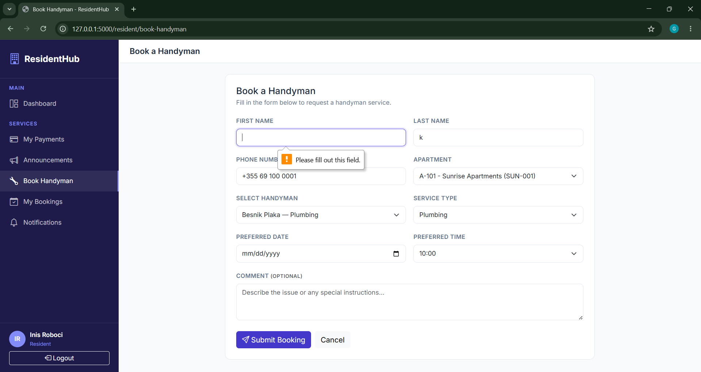
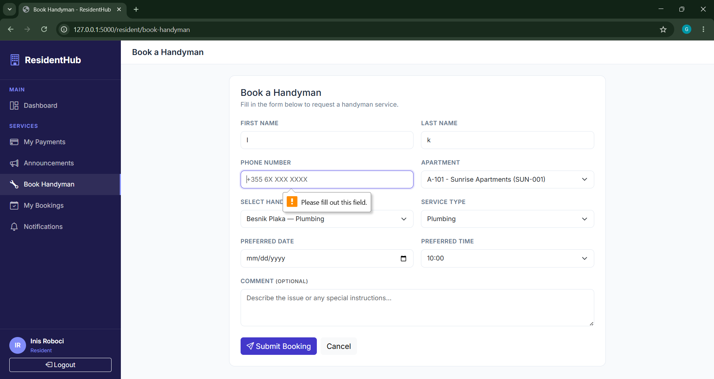
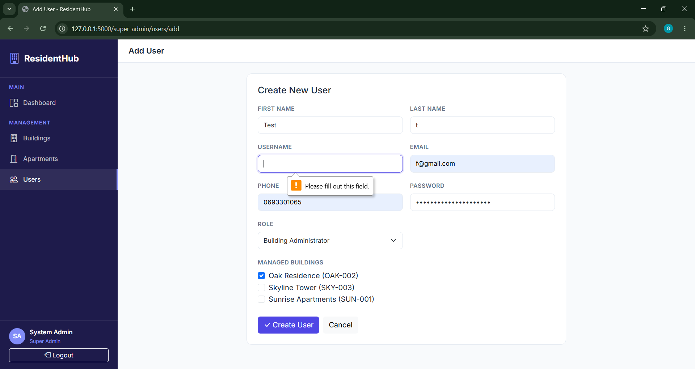
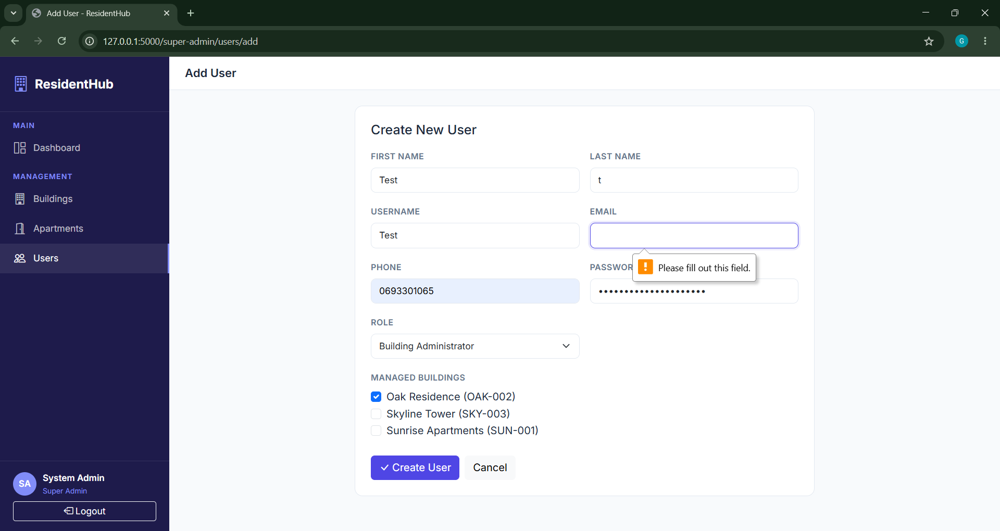
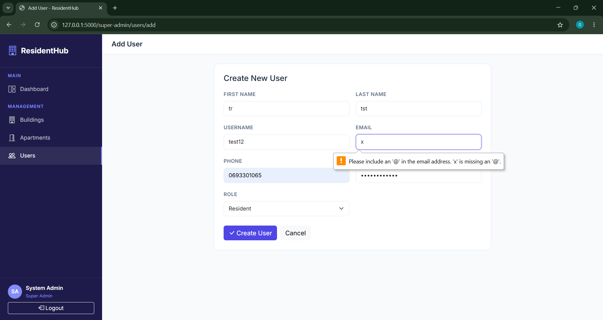
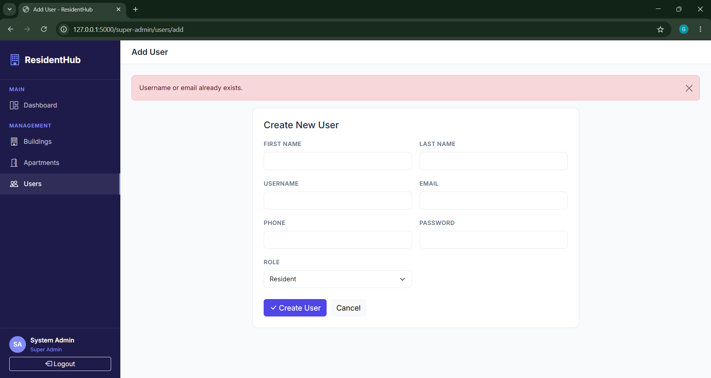

# Phase IV: Software Testing

## 1. Introduction to Testing
Software testing is the process of evaluating a software system to identify defects, bugs, or any unexpected behavior. It ensures that the system functions correctly according to the specified requirements.

Testing is an important part of software development because it helps improve the reliability, correctness, and maintainability of the system. By detecting issues early, testing ensures that the system performs as expected and provides a better experience for users.

## 2. Purpose of Testing
The purpose of software testing is to identify defects and errors early in the development process, before the system is delivered to users. Early detection helps reduce costs and improves overall software quality.
Testing also ensures that software components behave as intended under both expected and unexpected conditions. It verifies that the system produces correct results and can handle different types of inputs without failure.

# FIRST COMPONENT - Booking Handyman function
## 3.1 Focus on Testing a Single Component
The selected component for testing is the Booking Handyman function. This component is important because it allows residents to request maintenance services by submitting booking details such as date, time and service type.
This function plays a key role in the system’s operation, as it connects residents with handymen and ensures that service requests are properly recorded and managed. If this function does not work correctly, residents may be unable to submit requests, or bookings may not be stored accurately in the system.
The booking function is also critical because it handles multiple conditions, such as validating user input, processing form data, creating booking records and generating notifications. Since this process directly affects service management, user experience and system reliability, it must be tested carefully.


## 4.1 Preparing Test Cases
The test cases were designed to cover different scenarios of the Booking Handyman Service function, including valid inputs, invalid inputs and boundary cases.

| Test ID | Scenario                       | Input                                                                 | Expected Result                                              |
|--------|--------------------------------|----------------------------------------------------------------------|-------------------------------------------------------------|
| TC01   | Valid booking request          | All required fields filled (handyman, apartment, date, time, name, phone) | Booking is created successfully and saved in database       |
| TC02   | Missing handyman               | handyman_id not selected                                             | Form validation prevents submission                         |
| TC03   | Missing apartment              | apartment_id not selected                                            | Form validation prevents submission                         |
| TC04   | Missing preferred date         | preferred_date empty                                                 | Form validation prevents submission                         |
| TC05   | Missing preferred time         | preferred_time empty                                                 | Form validation prevents submission                         |
| TC06   | Invalid phone number format    | Phone number entered incorrectly (e.g., letters or too short)        | Error: "Invalid phone number format."                       |
| TC07   | Empty optional field (comment) | Comment left empty                                                   | Booking is created successfully                             |
| TC08   | No available handymen          | Handymen list is empty                                               | Warning: "No handymen available."                           |


## 5.1 Writing Test Code
In the Booking Handyman Service component, error handling is mainly implemented through frontend form validation and database constraints.

```html
```html
<input type="text" name="first_name" class="form-control" required>

<select name="handyman_id" class="form-select" required>
    
<input type="date" name="preferred_date" class="form-control" required>

<select name="preferred_time" class="form-select" required>
```

These required attributes ensure that users cannot submit the form unless all mandatory fields are filled. This prevents empty or incomplete data from being sent to the backend.

Additionally, the system handles special conditions in the interface:

```html


<div class="alert alert-warning">No handymen are currently available.</div>



<div class="alert alert-warning">You are not assigned to any apartment yet.</div>


```

This ensures that users are informed when booking is not possible.

On the backend, the system processes the data and stores it in the database:

```python
booking = Booking(...)

db.session.add(booking)

db.session.commit()
```

Further validation is enforced by the database model:

```python
first_name = db.Column(db.String(80), nullable=False)

preferred_date = db.Column(db.Date, nullable=False)
```

These constraints ensure that required fields cannot be null, providing an additional layer of data integrity.

## 6.1  Running Tests
The tests were executed directly within the system environment we developed. The booking form was tested by interacting with the application through the user interface and submitting different inputs.





# SECOND COMPONENT - Super Admin Create User function
## 3.2 Focus on Testing a Single Component
The selected component for testing is the Super Admin Create User function. This component is important because it allows the Super Admin to create new user accounts in the system, including Admins, Residents, and Handymen.
This function plays a key role in system management since all users must be created through it before they can access the system. If this function does not work correctly, users may not be created properly, which would affect the entire system’s functionality and organization.
The create user function is also critical because it handles multiple inputs such as username, email, password, and role selection. It also ensures that only authorized Super Admins can create accounts and that the correct user roles are assigned. Since this process directly affects system access, structure, and security, it must be tested carefully.

## 4.2 Preparing Test Cases
| Test ID | Scenario                          | Input                                                     | Expected Result                                      |
|--------|----------------------------------|----------------------------------------------------------|-----------------------------------------------------|
| TC01   | Valid user creation (Resident)   | All required fields filled, role = resident              | User is created successfully                        |
| TC02   | Valid user creation (Admin)      | Valid data + role = admin + selected buildings           | User created and assigned to buildings              |
| TC03   | Valid user creation (Handyman)   | Valid data + role = handyman + specialty/bio             | User created with handyman details                  |
| TC04   | Missing username                 | Username field empty                                     | Form validation prevents submission                 |
| TC05   | Missing email                    | Email field empty                                        | Form validation prevents submission                 |
| TC06   | Missing password                 | Password field empty                                     | Form validation prevents submission                 |
| TC07   | Duplicate username/email         | Existing username or email                               | Error: "Username or email already exists."          |
| TC08   | Invalid email format             | Email does not include "@" (e.g., userexample.com)       | Error: "Invalid email format."                      |

## 5.2 Writing Test Code
In the Super Admin Create User component, error handling is mainly implemented through frontend form validation and backend validation logic.

```html
<input type="text" name="username" class="form-control" required>

<input type="email" name="email" class="form-control" required>

<input type="password" name="password" class="form-control" required minlength="4">

<select name="role" class="form-select" required>
```

These required attributes ensure that users cannot submit the form unless all mandatory fields are filled. This prevents empty or incomplete data from being sent to the backend.

Additionally, the system handles role-based dynamic fields in the interface:

```javascript
function toggleRoleFields() {

    const role = document.getElementById('roleSelect').value;
    
    document.getElementById('buildingField').style.display = role === 'admin' ? '' : 'none';
    
    document.getElementById('specialtyField').style.display = role === 'handyman' ? '' : 'none';
    
}
```

This ensures that only relevant fields are shown based on the selected user role (Admin, Resident, Handyman).

On the backend, the system processes the data and performs validation before storing it in the database:

```python
if User.query.filter((User.username == username) | (User.email == email)).first():

    flash("Username or email already exists.", "danger")
```

This prevents duplicate usernames or emails from being created in the system.

If validation passes, the user is created and stored:

```python
user = User(...)

db.session.add(user)

db.session.commit()
```

Further validation is enforced by the database model:

```python
username = db.Column(db.String(80), unique=True, nullable=False)

email = db.Column(db.String(120), unique=True, nullable=False)

password = db.Column(db.String(200), nullable=False)
```

These constraints ensure that required fields cannot be null and that usernames and emails remain unique, providing an additional layer of data integrity.

## 6.2 Running Tests
The tests were executed directly within the system environment we developed. The Create User form was tested by interacting with the application through the user interface and submitting different inputs for various user roles (Admin, Resident, Handyman).









## 7. Test Coverage
Test coverage is important because it ensures that different parts of the system are tested, helping to detect errors early and improve the reliability and quality of the software.
In general, good test coverage includes testing normal scenarios, edge cases, and invalid inputs. This helps verify that the system behaves correctly under both expected and unexpected conditions.
The tests should cover the most important paths of the component, such as successful operations, missing or incorrect inputs, and possible failure situations. While basic test cases may cover the main functionality, adding more edge cases and error scenarios can further improve the completeness and effectiveness of testing.


